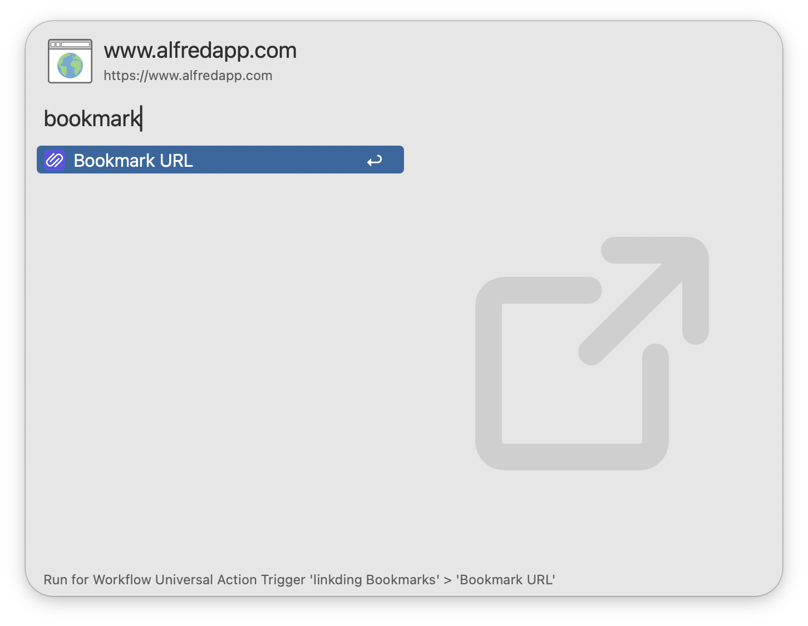

#  linkding Bookmarks

Search linkding bookmarks in Alfred

[⤓ Install from the Alfred Gallery](https://alfred.app/workflows/firefingers21/linkding-bookmarks/)

## Setup

Set the Base URL and API Token of your [linkding](https://github.com/sissbruecker/linkding) installation in the [Workflow’s Configuration](https://www.alfredapp.com/help/workflows/user-configuration/). You can find the API Token from your linkding Settings → Integrations → Rest API.

**Note**: This workflow requires [jq](https://jqlang.github.io/jq/) to function, which now comes preinstalled on macOS Sequoia 15.0.0 and later.

## Usage

Search for your [linkding](https://github.com/sissbruecker/linkding) bookmarks using the `bm` keyword.

Type to refine your search. Bookmarks are always filtered by title, while filtering by description, notes, URL, and tags are [configurable](https://www.alfredapp.com/help/workflows/user-configuration/).

* <kbd>↩</kbd> Open bookmark in primary browser
* <kbd>⇧</kbd><kbd>⌘</kbd><kbd>↩</kbd> Open in primary browser without closing Alfred (when browser is in focus)
* <kbd>⌘</kbd><kbd>↩</kbd> Open bookmark in secondary browser
* <kbd>⌥</kbd><kbd>↩</kbd> Edit bookmark in linkding
* <kbd>⇧</kbd><kbd>⌥</kbd><kbd>↩</kbd> View bookmark in linkding
* <kbd>⌃</kbd><kbd>↩</kbd> Delete bookmark from linkding
* <kbd>⌘</kbd><kbd>C</kbd> Copy bookmark URL
* <kbd>⌘</kbd><kbd>L</kbd> View all tags and full URL in Large Type
* <kbd>⇧</kbd> Hold to show bookmark description

Append `::` to the configured [Keyword](https://www.alfredapp.com/help/workflows/inputs/keyword) to access other actions, including manually reloading the bookmark cache. You can also directly change the Workflow's default browser settings from here.

Bookmark auto-updating is supported and [configurable](https://www.alfredapp.com/help/workflows/user-configuration/).

Favicons are also supported, and must be enabled in both the [Workflow’s Configuration](https://www.alfredapp.com/help/workflows/user-configuration/) and your linkding settings.

Configure the [Hotkey](https://www.alfredapp.com/help/workflows/triggers/hotkey/) as a shortcut to search for your bookmarks. Use the [Universal Action](https://www.alfredapp.com/help/features/universal-actions/) to bookmark URLs from Alfred’s [Clipboard History](https://www.alfredapp.com/help/features/clipboard/) or selected text.

Bookmarks with the tag `Exclude-Alfred` will be hidden from search. This tag is case sensitive.
