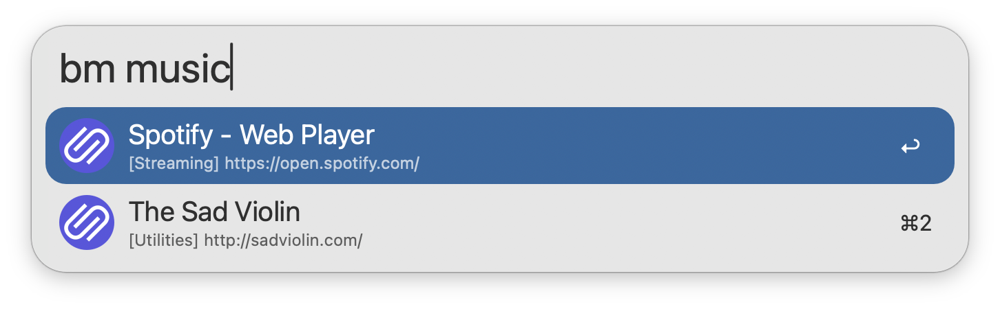

#  linkding Bookmarks

Search linkding bookmarks in Alfred

[⤓ Install from the Alfred Gallery](https://alfred.app/workflows/firefingers21/linkding-bookmarks/)

## Setup

Set the Base URL and API Token of your [linkding](https://linkding.link/) installation in the [Workflow’s Configuration](https://www.alfredapp.com/help/workflows/user-configuration/). You can find the API Token from your linkding Settings → Integrations → Rest API.

**Note**: This workflow requires [jq](https://jqlang.github.io/jq/) to function, which comes preinstalled on macOS 15 Sequoia and later.

## Usage

Search for your [linkding](https://linkding.link/) bookmarks via the `bm` keyword. Type to refine your search.

Bookmarks are always searchable by title, while filtering by Description, Notes, URL, and Tag is configurable from the [Workflow’s Configuration](https://www.alfredapp.com/help/workflows/user-configuration/).

* <kbd>↩</kbd> Open bookmark in primary browser
* <kbd>⇧</kbd><kbd>⌘</kbd><kbd>↩</kbd> Open in primary browser without closing Alfred
* <kbd>⌘</kbd><kbd>↩</kbd> Open bookmark in secondary browser
* <kbd>⌥</kbd><kbd>↩</kbd> Edit bookmark in linkding
* <kbd>⇧</kbd><kbd>⌥</kbd><kbd>↩</kbd> View bookmark in linkding
* <kbd>⌃</kbd><kbd>↩</kbd> Delete bookmark from linkding
* <kbd>⌘</kbd><kbd>L</kbd> View all tags and full URL in Large Type
* <kbd>⇧</kbd> Hold to show bookmark description

Append `::` to the configured [Keyword](https://www.alfredapp.com/help/workflows/inputs/keyword) to access other actions, such as manually reloading the bookmark cache.

Favicons are supported, and must be enabled in both the [Workflow’s Configuration](https://www.alfredapp.com/help/workflows/user-configuration/) and your linkding settings.

Configure the [Hotkey](https://www.alfredapp.com/help/workflows/triggers/hotkey/) as a shortcut for searching your bookmarks. Use the [Universal Action](https://www.alfredapp.com/help/features/universal-actions/) to bookmark URLs from Alfred’s [Clipboard History](https://www.alfredapp.com/help/features/clipboard/) or selected text.

Bookmarks with the tag `Exclude-Alfred` will be hidden from search. This tag is case sensitive.
